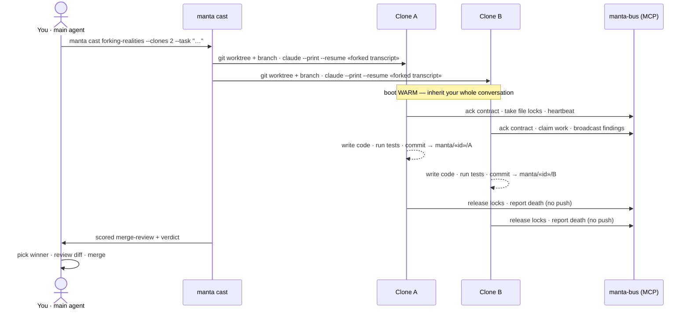
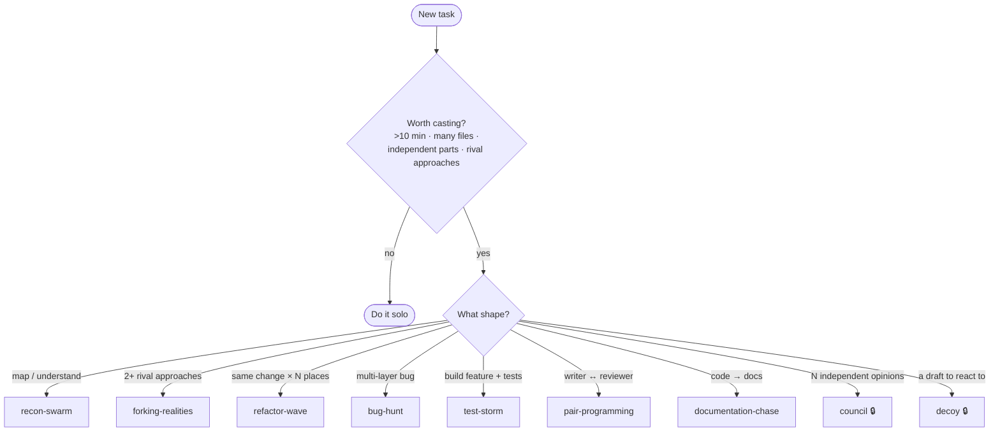

<div align="center">


# ⧉ Manta

**Claude Code that clones *itself* to work in parallel** — same system prompt, your full conversation inherited, each clone in its own isolated git worktree, coordinating over a message bus.

[](CHANGELOG.md)
[](LICENSE)
[](.nvmrc)
[](#-how-ready-is-it)
[](#-how-ready-is-it)
[](#-install)

[What & why](#what-it-is) · [How it works](#-how-it-actually-works) · [Install](#-install) · [First cast](#-your-first-cast-worked-example) · [Modes](#-modes) · [CLI](#-cli-reference) · [Status](#-how-ready-is-it)

</div>

---

## What it is

It is **not** a multi-agent framework with specialized roles. There is no "researcher agent" and "coder agent." When you cast Manta, you spawn copies of the *same* agent you're already talking to — each one starts with everything you've discussed, then goes off and does real work (writes code, runs tests, commits) on its own branch, in parallel.

> [!NOTE]
> **TL;DR**
> - You're in a Claude Code session. You hit a task that's big, repetitive, or has independent parts.
> - You run `manta cast <mode> --task "..."`. Manta spawns N clones of your current agent.
> - Each clone gets its **own git worktree**, **your full transcript** (so it knows what you know), and a **task contract**.
> - Clones work in parallel, coordinate through a bus (file locks, work claims, broadcasts), commit to their own branches, and shut down cleanly.
> - You review their output, merge the good work, and keep going.
>
> **Parallelism without losing context, and without designing a role hierarchy. A clone is just *you*, again, somewhere else.**

---

## Why it exists

Claude Code already has subagents (the `Agent` tool). They're useful, but they have two limits, and existing multi-agent frameworks answer parallelism a different way. Manta takes the opposite bet:

| | Claude Code subagents | CrewAI / AutoGPT / LangGraph | **Manta** |
|---|---|---|---|
| **Context** | start **cold** — fresh, re-explain everything | per-role prompts you author | **warm** — inherits your full live transcript |
| **Parallelism** | one-shot helper, returns a message | role graph you design & maintain | N clones on real branches, coordinating live |
| **Owns a branch / locks?** | ✗ | varies | ✓ real `git worktree` + bus locks |
| **Setup cost** | none, but cold | design a crew up front | none — clone the agent that *already* gets it |
| **Bet** | quick fresh helper | specialize roles | **don't specialize — clone** |

The agent that already understands the problem (because it's been in the conversation) is the best worker for it. So Manta forks *that* agent — same system prompt, same transcript — N times, and lets the copies divide work dynamically through coordination primitives instead of a fixed role graph.

As far as we know, Manta is the first **same-system-prompt, full-transcript-inheritance** cloning pattern for Claude Code.

> [!TIP]
> If your task takes you 5 minutes solo, **don't cast** — just do it. Manta earns its keep when the work is big, branchy, or repetitive. The built-in `manta-cast-decide` skill is a gut-check for exactly this.

---

## 🔭 How it actually works

A cast runs a real lifecycle — allocate isolated worktrees, fork your context into each clone, hand off contracts, work in parallel on the bus, commit, and hand you a reviewed result:



<details>
<summary><b>The same lifecycle, step by step (click to expand)</b></summary>

1. **Allocate & isolate.** Manta picks clone slots (letters A, B, …) and creates a **git worktree** for each under `.manta/worktrees/` — a separate checkout on its own branch (`manta/cast-<id>/A`, …). Clones never stomp on your working tree or each other's.
2. **Inherit your context.** Manta finds your current Claude session's transcript and **forks a copy** into each clone's worktree, then boots the clone with `claude --print --resume <forked-transcript>`. The clone wakes up knowing the whole conversation. *(For very large transcripts there's a size threshold; over it the clone boots without inheritance and says so **loudly** — never silently.)*
3. **Hand off a contract.** Each clone gets a **task contract**: what to build, its scope fence (which paths it may touch), its budget, success criteria. It acknowledges the contract on the bus before starting.
4. **Work in parallel, coordinate on the bus.** Clones run independently but talk through the **Manta bus** (an MCP server): **file locks** (no two clones edit the same file), **work claims**, **broadcasts**, **heartbeats**. No clone can silently corrupt shared state.
5. **Commit & die gracefully.** When done a clone writes a report, commits to its branch, records a one-paragraph "most surprising thing I learned" note, releases its locks, and signals its own death. It does **not** push — the main agent pulls.
6. **You review & merge.** For `forking-realities`, Manta scores the competing branches (a quality gate that mirrors your canonical `pnpm gate`) and writes a **merge-review** with a verdict. You read it, pick the winner, code-review the diff, merge. `recon-swarm` is simpler: clones explore and each writes an audit doc — nothing merges, you just get the intelligence.

</details>

### The pieces

| Piece | What it is |
|---|---|
| **Worktrees** | Each clone gets an isolated `git worktree` on its own branch. Isolation is real, not cooperative. |
| **Transcript inheritance** | Clones boot from a fork of your live session transcript via `claude --resume`. They start *warm*. |
| **The bus (MCP server)** | `manta-bus` — locks, work claims, broadcasts, heartbeats, task contracts, ZK notes. Coordination without a central scheduler. |
| **Task contracts** | The explicit spec + scope fence + budget each clone agrees to before working. |
| **Charges & budgets** | A usage-aware rate/parallelism system (`manta charges` / `cost` / `limit`) so a cast can't exhaust your subscription's usage limit or your machine. |
| **Merge-review** | For competing branches, an automated quality-gated score + verdict you follow when merging. |
| **Skills** | Markdown behavior contracts (`manta-as-clone`, `manta-graceful-death`, …) that tell clones how to behave. Shipped with the plugin. |

---

## 📦 Install

Manta ships two ways. **The Claude Code plugin is the primary path** — it lights up `/manta:*` slash commands, surfaces Manta's skills to your session and to spawned clones, and auto-registers the `manta-bus` MCP server. The **npm CLI** is the terminal / power-user path.

### Plugin (recommended)

From inside Claude Code:

```
/plugin marketplace add https://github.com/tr00x/Manta.git
/plugin install manta@manta-dev
```

The marketplace's name is `manta-dev` (in `.claude-plugin/marketplace.json`); the plugin inside it is `manta`. The install spec is `<plugin>@<marketplace>` → `manta@manta-dev`. Run `/manta:help` after install for a tour, or `manta doctor` from a terminal to health-check your setup. You then have:

- **`/manta:*` slash commands** (cast, status, cost, charges, inspect, tail, kill, promote, recover, replay, abort, doctor, help) wrapping the bundled `manta` binary.
- **Manta's skills** in your skill list (e.g. `manta-cast-decide` — "should I even cast this?"), resolvable by spawned clones.
- **The `manta-bus` MCP server**, registered automatically — no `claude mcp add`, no manual setup. It exposes both the clone-coordination tools *and* 6 native orchestrator tools (`manta_cast`, `manta_status`, …) so your agent can drive Manta with native tool calls.

To test a local checkout without the marketplace:

```
claude --plugin-dir /path/to/Manta     # loads /manta:* for that session
claude plugin validate /path/to/Manta  # checks the manifest
```

> [!WARNING]
> **Working *inside* the Manta repo? `/manta:*` may disappear.** Known Claude Code limitation ([#14929](https://github.com/anthropics/claude-code/issues/14929)): when cwd = this repo, CC auto-discovers the repo's own `.claude-plugin/marketplace.json` as a *directory* marketplace, whose slash commands silently fail to register. The CLI (`manta …`) works regardless of cwd.
>
> <details><summary>Contributor workarounds</summary>
>
> - **Load the checkout from a sibling directory** (uses the `--plugin-dir` path, which surfaces commands):
>   ```
>   cd /some/other/dir && claude --plugin-dir /path/to/Manta
>   ```
> - **Or disable the installed copy** — in `~/.claude/settings.json` set `"enabledPlugins": { "manta@manta-dev": false }`, then `claude --plugin-dir .` from the repo.
> </details>

### npm CLI (terminal / power-user)

> [!IMPORTANT]
> The npm package is **`@tr00x/manta`** (the unscoped `manta` name belongs to an unrelated package — do **not** `npx manta`). Until it's published the npm path errors with "could not determine executable" — use the plugin path above (works today) or a source checkout.

```
npx @tr00x/manta@latest install          # registers the manta-bus MCP server
manta cast recon-swarm --clones 2 --task "Map this codebase"
```

> [!NOTE]
> The CLI's `cast` runs from inside a Manta-enabled checkout that carries the `skills/` directory. The plugin path has no such precondition — skills ship with the plugin.

Full walkthrough: [`docs/user/getting-started.md`](docs/user/getting-started.md) · Plugin internals: [`docs/internals/plugin-packaging.md`](docs/internals/plugin-packaging.md)

---

## 🚀 Your first cast (worked example)

Mid-session, want to understand an unfamiliar codebase before changing it? That's a read-only mapping job — perfect for `recon-swarm`:

```bash
manta cast recon-swarm --clones 2 \
  --task "Map the auth and billing subsystems: entry points, data flow, where to add a feature" \
  --max-files-changed 3 --allowed-paths "docs/audits"
```

Watch it:

```text
$ manta status
⧉ Clone | Mode         | State    | Heartbeat age | Locks | Claims
  A     | recon-swarm  | WORKING  | 2s            | -     | -
  B     | recon-swarm  | WORKING  | 4s            | -     | -

↑ "Clone" is the id. Stop one: manta kill <id> · stop all: manta abort · details: manta inspect <id>
```

Each clone reads the codebase **warm** (it already knows from your conversation what you care about) and writes an audit doc under `docs/audits/`. You read two focused write-ups instead of spelunking yourself — and your own context window stays clean.

For implementation work with a genuine "which approach?" question:

```bash
manta cast forking-realities --clones 2 --task "Migrate the config loader to zod"
```

Two clones each build it their own way. Manta scores both, writes `docs/merge-reviews/cast-<id>.md` with a verdict, and you merge the winner. Stop everything anytime with `manta abort`.

> [!TIP]
> Prefer native tool calls over shelling out? Your orchestrator can drive Manta through MCP tools — `manta_cast`, `manta_status`, `manta_cost`, `manta_inspect`, `manta_abort`, `manta_kill`. See [`docs/user/mcp-tools.md`](docs/user/mcp-tools.md).

---

## 🎛 Modes

A "mode" sets how clones behave and how many spawn. Pick by the **shape** of the work:



| Mode | Clones | Use when |
|---|---|---|
| `recon-swarm` | 1–5 | **Read-only.** Map a codebase, gather intelligence, write audits. Nothing merges. |
| `bug-hunt` | 1+ | A multi-layer bug with unknown root cause, or a well-scoped implementation task. |
| `refactor-wave` | 2–5 | The **same migration pattern** repeated across N disjoint places. |
| `forking-realities` | 2+ | **2+ non-obvious approaches** — built and scored, then you merge the best. |
| `pair-programming` | 2 | Writer + reviewer loop on one risky change. |
| `test-storm` | 3 | Build a feature **and** its test wall (coder + tester + fuzzer). |
| `documentation-chase` | 1+ | Bring docs in line with reality (markdown only). |
| `council` 🔒 | 3–5 | N **independent** proposals to a hard judgment call; you aggregate (no auto-merge). |
| `decoy` 🔒 | 1–2 | A **draft** deliverable to react to and finalize, not a finished artifact. |

> [!NOTE]
> 🔒 **`council` and `decoy` are Aghs-locked** — opt in via `.manta/config/budget.json` (`aghs.unlocked: [...]`) or the `MANTA_UNLOCK_AGHS` env var. `phantom-lance` (recursive self-cast) is intentionally **not** shipped. Per-mode docs live in [`docs/user/`](docs/user/).

---

## ⌨️ CLI reference

```text
manta cast <mode> --task "..."   Spawn clones for a mode (the core verb)
manta status                     Active clones, their state, locks, claims
manta inspect <cloneId>          Deep-dive one clone: contract, locks, events (--json)
manta tail <cloneId>             Stream a clone's events live
manta promote <castId/cloneId>   Merge the winning branch of a forking cast
manta abort                      Stop all active clones now
manta kill <cloneId>             Stop a single clone
manta recover                    Clean up stale state after a crash
manta cost [period]              Usage summary (subscription-usage proxy, not dollars)
manta charges                    Charge/cooldown state + which modes are available
manta limit                      Read/write usage-budget config
manta doctor                     Health-check Node, claude CLI, bus, git repo, charges
```

<details>
<summary>Usage caps & advanced flags (click to expand)</summary>

Claude Code is a **subscription**, not pay-per-token — so the guardrails are usage/rate/parallelism, never dollars:

```text
--max-parallel-clones <n>   cap clones running at once (default 5)
--max-casts-per-hour <n>    rolling-hour cast-rate cap (default 6)
--max-tokens-estimate <n>   per-cast usage ceiling (token-estimate proxy)
--allowed-paths / --forbidden-paths   scope fence (CSV)
--max-files-changed <n>     per-clone write cap (0 = read-only)
--dry-run                   preview usage without spawning
--tasks <file.yaml>         per-clone task/approach/scope overlays
```

`daemon` (persistent clones), `share` (publish a cast as a reusable package), and `library` (install shared Manta packages) round out the surface — `manta --help` for the full list.

</details>

---

## ✅ How ready is it?

Honest status — this is `0.1.0`, **early but real, not a toy and not a demo.** Everything below is verified by tests run independently — no self-reported green.

| Area | Status |
|---|---|
| **Transcript inheritance** | ✅ clones provably boot with the caster's context (acceptance e2e reproduces a parent-only sentinel; a negative control inherits nothing) |
| **Isolation & coordination** | ✅ worktrees, the bus (locks/claims/broadcasts/heartbeats), task contracts, graceful death |
| **All 9 cast modes** | ✅ 7 built-in + Aghs-locked `council` & `decoy` (opt-in) |
| **MCP surface** | ✅ 31 tools: 25 clone-coordination + 6 native orchestrator tools |
| **Merge-review gate** | ✅ mirrors the canonical `pnpm gate` (typecheck + lint + tests) before scoring |
| **Charges / budgets / cooldowns** | ✅ usage-aware runaway guardrails |
| **Distribution** | ✅ single self-contained npm artifact + a validated Claude Code plugin |
| **Clone cold-start** | ✅ booting-heartbeat at launch; large parent transcripts no longer reaped before first bus call (proven on a multi-MB session) |
| **Concurrent casts** | ✅ disjoint clone letters via atomic registry CAS + a data-loss guard (verified 4 clones in parallel) |
| **Clone safety** | ✅ always-on PreToolUse guard hard-enforces scope + blocks dangerous ops in the harness, not just via priming |
| **Observability** | ✅ conditional statusline, `manta doctor`, `manta tail`, post-mortems, replay |
| **Gate** | ✅ **183 test files / 1667 tests green** (real-claude e2e visibly skipped unless `MANTA_E2E=1`) |

> [!WARNING]
> **Known limitations** (tracked in [`docs/manta-bugs.md`](docs/manta-bugs.md)) — none block normal use:
> - **macOS / Linux first** — Windows isn't yet exercised (`sh -c` wrappers, SIGTERM semantics need a pass).
> - **Inside the Manta repo itself**, `/manta:*` collides with the installed plugin of the same name (upstream [#14929](https://github.com/anthropics/claude-code/issues/14929)) — use `claude --plugin-dir .` there. Users in their own projects are unaffected.

Phases 0–8 of the internal build are complete (see [`CHANGELOG.md`](CHANGELOG.md)).

---

## 📚 Design & internals

- **Design spec (source of truth):** [`docs/superpowers/specs/2026-05-06-manta-pattern-design.md`](docs/superpowers/specs/2026-05-06-manta-pattern-design.md)
- **Getting started:** [`docs/user/getting-started.md`](docs/user/getting-started.md)
- **All 9 mode guides + MCP tools:** [`docs/user/`](docs/user/)
- **Plugin packaging:** [`docs/internals/plugin-packaging.md`](docs/internals/plugin-packaging.md)
- **Bug log (lived-in, honest):** [`docs/manta-bugs.md`](docs/manta-bugs.md)

---

<div align="center">

**MIT** — see [`LICENSE`](LICENSE). · Built with [Claude Code](https://claude.com/claude-code).

</div>
