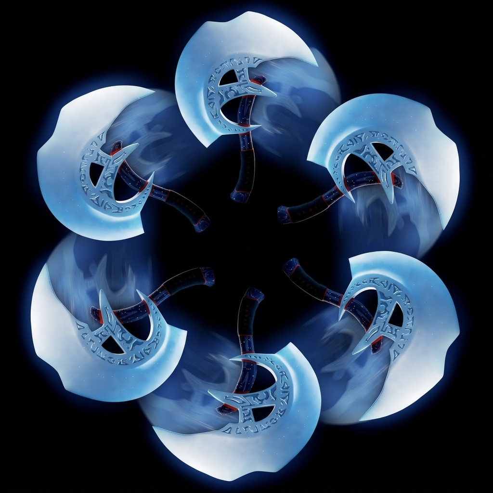
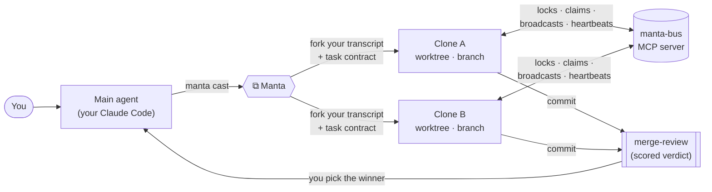
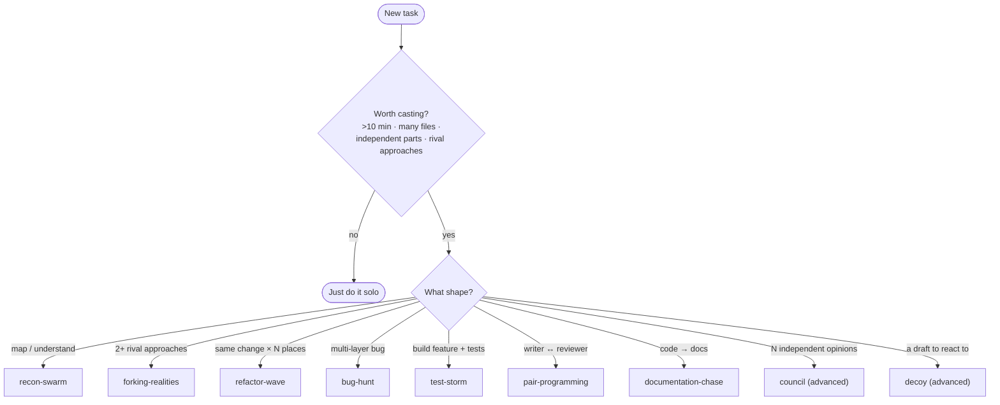

<table>
<tr>
<td width="42%" align="center">



</td>
<td width="58%" valign="middle">

# ⧉ Manta

### Clone Driven Development

**A new experiment in parallel AI coding.**

Instead of spawning cold, specialized helper agents, Manta makes Claude Code **clone _itself_**: same system prompt, your whole conversation inherited, each copy in its own isolated git worktree, all coordinating over a shared bus.

[](CHANGELOG.md)
[](LICENSE)
[](#install)
[](#how-ready-is-it)
[](#how-ready-is-it)
[](#install)

</td>
</tr>
</table>

<div align="center">

[What it is](#what-it-is) · [How it works](#how-it-works) · [Install](#install) · [First cast](#your-first-cast) · [Modes](#modes) · [CLI](#cli) · [Status](#how-ready-is-it)

</div>

---

## What it is

> **Subagent Driven Development** spawns fresh, specialized helpers that start cold and don't know what you've been working on.
>
> **Clone Driven Development** forks the agent that _already understands your problem_ — the one you've been talking to — into N copies that work in parallel on real branches.

You're in a Claude Code session. You hit something big, repetitive, or branchy. You run one command:

```bash
manta cast forking-realities --clones 2 --task "Add rate limiting to the API"
```

Manta spawns 2 clones of **your current agent**. Each one wakes up already knowing the whole conversation, gets its own git worktree, does real work (writes code, runs tests, commits to its own branch), and coordinates with its siblings over a message bus. You review what they built and merge the best.

That's it. No role hierarchy to design, no "researcher agent + coder agent" to wire up. **A clone is just _you_, again, somewhere else.**

> [!NOTE]
> Manta is an **experiment**, stated honestly: `0.1.0`, early, real, not a demo. As far as we know it's the first _same-system-prompt, full-transcript-inheritance_ cloning pattern for Claude Code. The core works and is tested ([see status](#how-ready-is-it)); the rough edges are listed, not hidden.

> [!TIP]
> **You don't have to drive the CLI.** Manta looks like a power-user tool — worktrees, a message bus, file locks. You can ignore all of it. Tell your agent _"orchestrate this with Manta"_ and it does the deciding: whether to cast, how many clones, reviewing their branches, merging the winner. You watch and approve.
>
> Power users get the raw `manta` CLI. Vibe-coders get a one-line ask. **Same engine underneath.**

---

## Why clone instead of spawn helpers?

Claude Code already has subagents (the `Agent` tool), and frameworks like CrewAI / LangGraph build crews of specialized roles. Manta makes a different bet:

|                            |   Subagents (`Agent` tool)   | Role frameworks (CrewAI, LangGraph) |         **Manta (Clone Driven)**         |
| -------------------------- | :--------------------------: | :---------------------------------: | :--------------------------------------: |
| **Context**                | cold — re-explain everything |     per-role prompts you write      | **warm** — inherits your live transcript |
| **Parallelism**            | one-shot, returns a message  |      a role graph you maintain      |      **N clones on real branches**       |
| **Owns a branch + locks?** |              ✗               |               varies                |    ✓ real `git worktree` + bus locks     |
| **Setup**                  |    none, but starts blind    |       design a crew up front        |   none — clone what already _gets it_    |

The agent that's been in the conversation is the best worker for the task. So Manta forks **that** agent and lets the copies divide the work live, through coordination primitives, instead of a fixed hierarchy.

> [!TIP]
> Task takes you 5 minutes solo? **Don't cast** — just do it. Manta earns its keep when the work is big, branchy, or repetitive. The built-in `manta-cast-decide` skill is a gut-check for exactly this.

---

## How it works

**The system** — your main agent casts clones into isolated worktrees; they coordinate over the bus and commit to their own branches; you get a reviewed result:



**The lifecycle** — what actually happens, in order:


<details>
<summary><b>Step by step (click to expand)</b></summary>

1. **Allocate & isolate.** Manta creates a **git worktree** per clone under `.manta/worktrees/` — a separate checkout on its own branch. Clones never touch your working tree or each other's.
2. **Inherit your context — conversation _and_ standards.** Manta forks a copy of your live session transcript into each clone and boots it with `claude --print --resume <fork>`, so the clone wakes up knowing the whole conversation. _(By **default** a clone forks your full transcript up to a safe **5 MB ceiling**, so it boots warm without blindly copying a multi-MB session across N clones; above the ceiling it cold-boots with a warning instead of freezing in `STARTING`. `--no-full-transcript` uses a conservative 2 MB ceiling, `--force-full-transcript` forks unconditionally with no ceiling, and `--distill-threshold-bytes <n>` retunes it.)_ It **also** copies your project's **`CLAUDE.md` / `CLAUDE.local.md`** into each clone's worktree — a clone's worktree is its own git checkout, and a gitignored `CLAUDE.md` would never reach it otherwise — so the clone also inherits your coding standards, conventions, and guardrails. (Opt out with `--no-inherit-instructions`.)
3. **Hand off a contract.** Each clone gets a **task contract** — what to build, which paths it may touch, its budget, success criteria — and acknowledges it on the bus before starting.
4. **Work in parallel, coordinate on the bus.** Clones talk through the **Manta bus** (an MCP server): **file locks** (no two edit the same file), **work claims**, **broadcasts**, **heartbeats**. No clone can silently corrupt shared state.
5. **Commit & die gracefully.** A clone writes a report, commits to its branch, releases its locks, and signals its own death. It does **not** push — you pull.
6. **You review & merge.** For competing approaches, Manta scores the branches against a quality gate and writes a **merge-review** with a verdict. You pick the winner and merge.

</details>

### The building blocks

| Block                      | What it is                                                                                                                                                                                                                           |
| -------------------------- | ------------------------------------------------------------------------------------------------------------------------------------------------------------------------------------------------------------------------------------ |
| **Worktrees**              | Each clone gets an isolated `git worktree` on its own branch. Isolation is real, not cooperative.                                                                                                                                    |
| **Transcript inheritance** | Clones boot from a fork of your live session via `claude --resume`. They start _warm_.                                                                                                                                               |
| **Project instructions**   | Your `CLAUDE.md` / `CLAUDE.local.md` are copied into every clone worktree (even when gitignored — a checkout wouldn't carry them). Each user's _own_ CLAUDE.md, never one baked into Manta. So clones obey your project's standards. |
| **The bus**                | `manta-bus` (MCP server) — locks, work claims, broadcasts, heartbeats, contracts. Coordination with no central scheduler.                                                                                                            |
| **Task contracts**         | The spec + scope fence + budget each clone agrees to before working.                                                                                                                                                                 |
| **Usage guardrails**       | A subscription-aware rate/parallelism system so a cast can't exhaust your usage limit or your machine.                                                                                                                               |
| **Merge-review**           | For competing branches, an automated quality-gated score + verdict you follow when merging.                                                                                                                                          |
| **Skills**                 | Plain-markdown behavior contracts that tell clones how to behave. Shipped with the plugin.                                                                                                                                           |

> [!IMPORTANT]
> **Your `CLAUDE.md` is half of what makes a clone more than a subagent.** Transcript inheritance carries the _conversation_; `CLAUDE.md` carries the _standards_ — your quality bar, conventions, and guardrails. A clone with neither is just a cold helper; a clone with both works like _you_ would. Manta delivers both automatically, so **a well-written `CLAUDE.md` directly raises the quality of every clone's output.** If you take cloning seriously, invest in your `CLAUDE.md` — it's the single highest-leverage file in a Clone Driven workflow.

---

## Install

Two ways. **The Claude Code plugin is the easy path** — it lights up `/manta:*` commands, ships the skills, and auto-registers the bus.

### Plugin (recommended)

From inside Claude Code:

```
/plugin marketplace add https://github.com/tr00x/Manta.git
/plugin install manta@manta-dev
```

The marketplace is `manta-dev`, the plugin inside it is `manta` → the install spec is `manta@manta-dev`. Then run `/manta:help` for a tour, or `manta doctor` in a terminal to health-check your setup. You get:

- **`/manta:*` slash commands** (cast, status, inspect, tail, kill, promote, recover, replay, abort, doctor, help).
- **Manta's skills** in your skill list, resolvable by spawned clones.
- **The `manta-bus` MCP server**, registered automatically — including native tool calls (`manta_cast`, `manta_status`, …) so your agent can drive Manta without shelling out.

Test a local checkout without installing: `claude --plugin-dir /path/to/Manta`.

> [!WARNING]
> **Working _inside_ the Manta repo itself? `/manta:*` may not show up.** A Claude Code quirk ([#14929](https://github.com/anthropics/claude-code/issues/14929)): with cwd = this repo, it discovers the repo's own marketplace as a directory and the slash commands silently don't register. The `manta` CLI works regardless of cwd.
>
> <details><summary>Workarounds for contributors</summary>
>
> - Launch from another directory: `cd ~ && claude --plugin-dir /path/to/Manta`
> - Or in `~/.claude/settings.json` set `"enabledPlugins": { "manta@manta-dev": false }`, then `claude --plugin-dir .` from the repo.
> </details>

### npm CLI (terminal)

Published as **[`@tr00x/manta`](https://www.npmjs.com/package/@tr00x/manta)** — live on npm.

> [!NOTE]
> Install the **scoped** name `@tr00x/manta`; plain `manta` is an unrelated package, so don't `npx manta`.

```
npx @tr00x/manta@latest install          # registers the manta-bus MCP server
manta cast recon-swarm --clones 2 --task "Map this codebase"
```

Full walkthrough → [Getting Started](docs/user/getting-started.md).

---

## Your first cast

Want to understand an unfamiliar codebase before changing it? That's a read-only mapping job — use `recon-swarm`:

```bash
manta cast recon-swarm --clones 2 \
  --task "Map the auth and billing code: entry points, data flow, where to add a feature" \
  --max-files-changed 3 --allowed-paths "docs/audits"
```

Watch it:

```text
$ manta status
⧉ Clone | Mode         | State    | Heartbeat age | Locks | Claims
  A     | recon-swarm  | WORKING  | 2s            | -     | -
  B     | recon-swarm  | WORKING  | 4s            | -     | -

↑ "Clone" is the id. Stop one: manta kill <id> · stop all: manta abort · details: manta inspect <id>
```

Each clone reads the code **warm** (it already knows what you care about from your conversation) and writes an audit doc. You read two focused write-ups instead of spelunking yourself — and your own context stays clean.

Got a real "which approach?" question? Use `forking-realities` — two clones each build it their way, Manta scores both, you merge the winner:

```bash
manta cast forking-realities --clones 2 --task "Migrate the config loader to zod"
```

Stop everything anytime with `manta abort`.

---

## Modes

A **mode** sets how clones behave and how many spawn. Pick by the shape of the work:



| Mode                  | Clones | Use when                                                                    |
| --------------------- | :----: | --------------------------------------------------------------------------- |
| `recon-swarm`         |  1–5   | **Read-only.** Map a codebase, gather intel, write audits. Nothing merges.  |
| `bug-hunt`            |   1+   | A multi-layer bug with unknown cause, or a well-scoped implementation task. |
| `refactor-wave`       |  2–5   | The **same change** repeated across many places.                            |
| `forking-realities`   |   2+   | **2+ rival approaches** — built, scored, you merge the best.                |
| `pair-programming`    |   2    | Writer + reviewer loop on one risky change.                                 |
| `test-storm`          |   3    | Build a feature **and** its tests (coder + tester + fuzzer).                |
| `documentation-chase` |   1+   | Bring docs in line with the code.                                           |
| `council` (advanced)  |  3–5   | N **independent** opinions on a hard call; you decide (no auto-merge).      |
| `decoy` (advanced)    |  1–2   | A **draft** to react to and finish, not a final artifact.                   |

> [!NOTE]
> `council` and `decoy` are opt-in advanced modes — enable them in `.manta/config/budget.json` (`aghs.unlocked: [...]`) or with the `MANTA_UNLOCK_AGHS` env var. Every mode has its own guide in **[docs/user/](docs/user/)**.

---

## CLI

```text
manta cast <mode> --task "..."   Spawn clones for a mode (the core verb)
manta status                     Active clones, their state, locks, claims
manta inspect <cloneId>          Deep-dive one clone: contract, locks, events
manta tail <cloneId>             Stream a clone's events live
manta promote <castId/cloneId>   Merge the winning branch of a forking cast
manta abort                      Stop all clones now   ·   manta kill <id>  one clone
manta recover                    Clean up stale state after a crash
manta limit                      Read/write the parallelism cap (max_parallel_clones)
manta doctor                     Health-check your environment
```

<details>
<summary>Usage caps & advanced flags</summary>

Claude Code is a **subscription**, not pay-per-token — so the only guardrail is parallelism, never dollars (no charges, no cooldown):

```text
--max-parallel-clones <n>   cap clones running at once (default 5) — the one usage limit
--allowed-paths / --forbidden-paths   scope fence (CSV)
--max-files-changed <n>     per-clone write cap (0 = read-only)
--dry-run                   preview without spawning
--tasks <file.yaml>         per-clone task / approach / scope overlays
```

</details>

---

## How ready is it?

Honest status — `0.1.0`, **early but real**. Everything below is verified by tests run independently; no self-reported green.

| Area                         | Status                                                                                                       |
| ---------------------------- | ------------------------------------------------------------------------------------------------------------ |
| **Transcript inheritance**   | ✓ clones provably boot with your context (a test reproduces a parent-only token; a control inherits nothing) |
| **Isolation & coordination** | ✓ worktrees, the bus (locks/claims/broadcasts/heartbeats), contracts, graceful death                         |
| **All 9 modes**              | ✓ 7 core + 2 opt-in (`council`, `decoy`)                                                                     |
| **Native MCP control**       | ✓ 30 bus tools, incl. 5 for driving Manta from your orchestrator                                             |
| **Merge-review gate**        | ✓ runs the real quality gate before scoring competing branches                                               |
| **Usage guardrail**          | ✓ subscription-aware parallelism cap (`--max-parallel-clones`) — no dollars, charges, or cooldown           |
| **Distribution**             | ✓ self-contained npm artifact + a validated Claude Code plugin                                               |
| **Concurrent casts**         | ✓ disjoint clone slots + a worktree data-loss guard keep parallel casts from corrupting shared state         |
| **Clone safety**             | ✓ an always-on guard enforces each clone's path scope + blocks dangerous ops in the harness                  |
| **Observability**            | ✓ live statusline, `manta doctor`, `manta tail`, post-run reports                                            |
| **Tests**                    | ✓ **1663 passing** (real-Claude end-to-end tests run on demand, never as a silent skip)                      |

> [!WARNING]
> **Known limitations** — none block normal use:
>
> - **macOS / Linux first.** Windows isn't exercised yet.
> - **Inside the Manta repo itself**, `/manta:*` collides with the installed plugin (upstream [#14929](https://github.com/anthropics/claude-code/issues/14929)) — use `claude --plugin-dir .` there. Users in their own projects are fine.

---

## Docs

- **[Getting Started](docs/user/getting-started.md)** — install, register the bus, run your first cast.
- **[Mode guides](docs/user/)** — one page per mode + native MCP tools.
- **[Plugin internals](docs/internals/plugin-packaging.md)** — how the plugin is packaged (for contributors).

---

## Manta builds Manta

Manta is **self-built**: once the first clones worked, they built the rest of Manta. Much of this codebase was implemented by Manta clones cast from a Claude Code session — bug-hunts, refactor-waves, doc-chases, forking-realities — then reviewed and merged by the main agent. The transcript-inheritance fix, the de-phased docs, even parts of this README were shaped by clones that inherited the conversation they were spawned from. Clone Driven Development, dogfooded all the way down.

---

<div align="center">

**MIT** — see [LICENSE](LICENSE). · An experiment built with [Claude Code](https://claude.com/claude-code), **using Manta to build Manta**.

</div>
